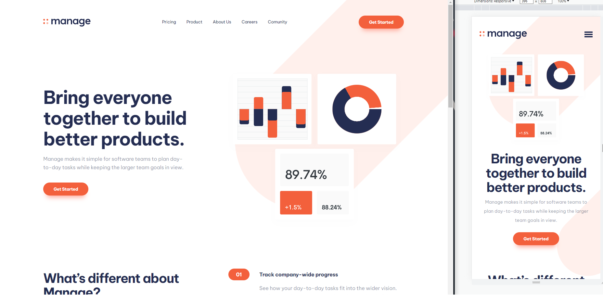

# Manage landing page

## Table of contents

- [Overview](#overview)
  - [The challenge](#the-challenge)
  - [Screenshot](#screenshot)
  - [Links](#links)
- [My process](#my-process)
  - [Built with](#built-with)
  - [What I learned](#what-i-learned)
  - [Continued development](#continued-development)
  - [Useful resources](#useful-resources)
- [Author](#author)
- [Design](#design/project)

## Overview

### The challenge

Users should be able to:

- View the optimal layout for the site depending on their device's screen size (mobile and desktop)
- See hover states for all interactive elements on the page
- See all testimonials in a horizontal slider
- On swipe slider on mobile size
- Receive an error message when the newsletter sign up `form` is submitted if:
  - The `input` field is empty
  - The email address is not formatted correctly
- Success message when sign up form is submited

### Screenshot

### Links

- Live Site URL: [Live Site](https://manage-landing-page-seven-theta.vercel.app/)

## My process

### Built with

- Semantic HTML5 markup
- CSS custom properties
- Flexbox
- CSS Grid
- Mobile-first workflow
- [Typescropt](https://www.typescriptlang.org/) - Typescript
- [Next.js](https://nextjs.org/) - React framework
- [Tailwind CSS](https://tailwindcss.com/) - For styles
- [Framer Motion](https://www.framer.com/motion/) - desktop testimonials carousel
- [React Swipeable](https://www.npmjs.com/package/react-swipeable) - mobile testimonials carousel

### What I learned

When faced with mobile testimonials component and how to implement finger swipe I discovered great library 'react-swipeable' , very easy to implement.

### Continued development

Add tablet version, in design there was only desktop and mobile, better style for tablet version.

### Useful resources

- [Tailwind docs](https://tailwindcss.com/docs/) - Always useful when working with tailwind.

## Author

- Linkedin - [Tomislav Sertic](https://www.linkedin.com/in/tomislav-serti%C4%87-85a0941a3/)
- Frontend Mentor - [@tsertic](https://www.frontendmentor.io/profile/tsertic)
- Instagram - [@tsertic5](https://www.instagram.com/tsertic5/)

## Design/Project

This is a solution to the [Manage landing page challenge on Frontend Mentor](https://www.frontendmentor.io/challenges/manage-landing-page-SLXqC6P5). Frontend Mentor challenges help you improve your coding skills by building realistic projects.
